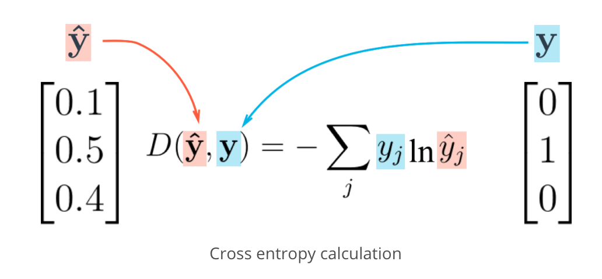

# Project Two

Prevent overfitting by using a validation set - test/train split

Accuracy: ratio of true positives + true negative / total number of 
classifications

R2 score get ratio of model accuracy versus simple model accuracy

### Types of Errors

Underfitting: error due to bias

Overfitting: error due to variance

Do not use testing data for training

## Sentiment Analysis

### Transforming text into numbers

Count each word, and use those counts as inputs to neural network. Output are 0 
for negative and 1 for positive. Force choice by only using binary labels - so 
reduce risk of error.

## Intro to TFLearn

[TFLearn](http://tflearn.org/)

### Activation Functions

Derivative of sigmoid function maxes out at 0.25, so backpropagation will 
reduce error by at least a quarter.

Rectified Linear Units (ReLUs): Has output of 0 if input is less than 0, 
otherwise returns input value. Much faster at training for large networks - 
[reference](http://www.cs.toronto.edu/~fritz/absps/imagenet.pdf)

[Drawbacks](https://cs231n.github.io/neural-networks-1/#nn): a large gradient 
can set the weights such that a ReLU unit will always be zero

Softmax: [wiki](https://en.wikipedia.org/wiki/Softmax_function) good for 
multclass classifications. Different to sigmoid function: softmax normalises the 
outputs. Output is a vector.

### Categorical Cross-Entropy

One-hot encoding: have a vector the length of the number of classes

[wiki](https://en.wikipedia.org/wiki/Cross_entropy)

As result of one-hot encoding, cross-entropy is just the natural log of the 
predicted probability of corresponding value.

### Sentiment Analysis with TFLearn

Overfitting wrt validation set, hyperparameter selection based on validation set 
only.
